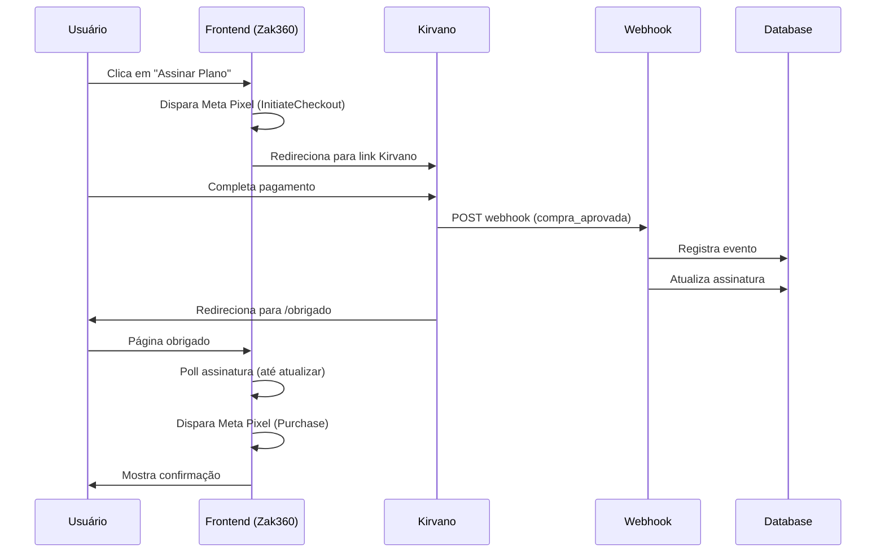

# Integração Kirvano - Webhooks

## Visão Geral

Este documento descreve a integração completa com o sistema de pagamentos Kirvano utilizando webhooks para atualização automática de planos e assinaturas.

## Configuração

### 1. Webhook na Kirvano

Configure o webhook no painel da Kirvano:

- **URL**: `https://cmcmliokvmnahcazavwv.supabase.co/functions/v1/kirvano-webhook`
- **Método**: `POST`
- **Headers obrigatórios**: 
  - `x-webhook-token: tokenappmec`
- **Eventos**: Todos os eventos relacionados a pagamentos e assinaturas

**Importante**: O header `x-webhook-token` com o valor `tokenappmec` é obrigatório para autenticação do webhook.

### 2. Links de Pagamento

Os seguintes links de pagamento estão configurados no sistema:

| Plano | Link |
|-------|------|
| Básico Mensal | https://pay.kirvano.com/46cd45d6-b09b-42f3-8036-448b63955812 |
| Básico Anual | https://pay.kirvano.com/a72b2648-2d46-43e1-b6a1-3c5751c6ead1 |
| Intermediário Mensal | https://pay.kirvano.com/89cdff61-8871-4938-9d49-56c7a9e2a15f |
| Intermediário Anual | https://pay.kirvano.com/60d387e1-d518-4f7a-935c-d345666ee7a1 |
| Profissional Mensal | https://pay.kirvano.com/e66550fb-05d7-4012-87b0-9764e56d0fbe |
| Profissional Anual | https://pay.kirvano.com/2ada7374-358e-4c9f-9e83-0f2c388d14de |

### 3. URL de Retorno Pós-Pagamento

Configure na Kirvano a URL de retorno após pagamento bem-sucedido:

**Success URL**: `https://seu-dominio.com/obrigado?email={customer_email}`

⚠️ **IMPORTANTE**: 
- Substitua `seu-dominio.com` pelo domínio real da sua aplicação
- Substitua `{customer_email}` pela variável que a Kirvano usa para o email do cliente
- O parâmetro `email` é opcional mas recomendado para melhor tracking
- Após a confirmação do pagamento, o usuário será automaticamente redirecionado para o dashboard

## Eventos Suportados

### 3.1 Compra Aprovada

**Tipos reconhecidos**: `compra_aprovada`, `payment_approved`, `approved`

**Ação**:
- Atualiza ou cria assinatura do usuário
- Define status como `active`
- Calcula próxima data de cobrança (mensal: +1 mês, anual: +1 ano)
- Associa link de pagamento ao usuário

**Campos esperados**:
```json
{
  "id": "evento_123",
  "event": "compra_aprovada",
  "customer": {
    "email": "usuario@email.com"
  },
  "payment_link_id": "46cd45d6-b09b-42f3-8036-448b63955812"
}
```

### 3.2 Assinatura Renovada

**Tipos reconhecidos**: `assinatura_renovada`, `subscription_renewed`, `renewed`

**Ação**:
- Mantém plano atual do usuário
- Atualiza próxima data de cobrança
- Define status como `active`

**Campos esperados**:
```json
{
  "id": "evento_456",
  "event": "assinatura_renovada",
  "customer": {
    "email": "usuario@email.com"
  },
  "payment_link_id": "46cd45d6-b09b-42f3-8036-448b63955812"
}
```

### 3.3 Assinatura Cancelada

**Tipos reconhecidos**: `assinatura_cancelada`, `subscription_canceled`, `canceled`

**Ação**:
- Reverte plano para `demonstracao`
- Define status como `canceled`
- Registra data de fim da assinatura

**Campos esperados**:
```json
{
  "id": "evento_789",
  "event": "assinatura_cancelada",
  "customer": {
    "email": "usuario@email.com"
  }
}
```

### 3.4 Assinatura Atrasada

**Tipos reconhecidos**: `assinatura_atrasada`, `subscription_overdue`, `payment_failed`

**Ação**:
- Define status como `past_due`
- Mantém plano atual (usuário ainda tem acesso temporário)
- Aguarda resolução do pagamento

**Campos esperados**:
```json
{
  "id": "evento_101",
  "event": "assinatura_atrasada",
  "customer": {
    "email": "usuario@email.com"
  }
}
```

## Estrutura do Banco de Dados

### Tabela `kirvano_eventos`

Armazena todos os eventos recebidos da Kirvano:

```sql
CREATE TABLE kirvano_eventos (
  id UUID PRIMARY KEY,
  kirvano_event_id TEXT UNIQUE NOT NULL,
  tipo TEXT NOT NULL,
  dados JSONB NOT NULL,
  processado BOOLEAN DEFAULT false,
  email_usuario TEXT,
  plano_tipo TEXT,
  created_at TIMESTAMPTZ DEFAULT NOW()
);
```

### Tabela `assinaturas`

Campos relacionados à Kirvano:

- `kirvano_customer_email`: Email do cliente na Kirvano
- `kirvano_subscription_id`: ID da assinatura (se fornecido)
- `kirvano_payment_link`: Link de pagamento utilizado
- `plano_tipo`: Tipo do plano (`basico_mensal`, `intermediario_mensal`, etc.)
- `status`: Status da assinatura (`active`, `canceled`, `past_due`, etc.)

## Administração

### Painel Admin

Acesse `/admin/kirvano` para:

- **Visualizar eventos**: Lista completa de eventos recebidos
- **Filtrar por status**: Processados vs Pendentes
- **Ver detalhes**: JSON completo de cada evento
- **Reprocessar**: Reenviar evento para processamento manual
- **Estatísticas**: Total, taxa de sucesso, distribuição por tipo

### Como Testar Manualmente

1. Acesse `/admin/kirvano`
2. Localize o evento que deseja testar
3. Clique no ícone de "reprocessar" (↻)
4. Verifique os logs da edge function para debugging

## Fluxo de Pagamento



## Meta Pixel Events

### InitiateCheckout
Disparado quando usuário clica em "Assinar Plano":
```javascript
fbq('track', 'InitiateCheckout', {
  content_name: 'Plano Intermediário Mensal',
  content_category: 'Subscription',
  currency: 'BRL',
  value: 49.90
});
```

### Purchase
Disparado na página `/obrigado` após confirmação:
```javascript
fbq('track', 'Purchase', {
  content_name: 'Plano Intermediário Mensal',
  content_category: 'Subscription',
  currency: 'BRL',
  value: 49.90
});
```

## Segurança

### Validação de Token

O webhook está protegido por token de autenticação. Todas as requisições devem incluir o header:
```
x-webhook-token: tokenappmec
```

Requisições sem token ou com token inválido receberão resposta `401 Unauthorized`.

### Validação Adicional (Futura)

Se a Kirvano fornecer método adicional de validação (HMAC, assinatura), implemente:

```typescript
async function validarAssinaturaKirvano(body: any, signature: string) {
  const webhookSecret = Deno.env.get("KIRVANO_WEBHOOK_SECRET");
  // Implementar validação conforme documentação Kirvano
}
```

Adicione o secret:
- Nome: `KIRVANO_WEBHOOK_SECRET`
- Valor: Fornecido pela Kirvano

## Troubleshooting Avançado

### 🔍 Ferramentas de Debug Disponíveis

1. **Dashboard Admin** (`/admin/kirvano`):
   - Estatísticas em tempo real
   - Filtros avançados por status, tipo e email
   - Visualização detalhada de payloads
   - Botão de reprocessamento manual
   - Taxa de sucesso e métricas

2. **Logs Detalhados**:
   - Todos os webhooks são logados com timestamps
   - Request ID único para rastreamento
   - Headers completos recebidos
   - Dados extraídos de todas as fontes
   - Tempo de processamento

3. **Edge Functions**:
   - `kirvano-webhook`: Processamento principal
   - `reprocessar-evento-kirvano`: Reprocessamento manual
   - `monitorar-eventos-kirvano`: Monitoramento e alertas

### ⚠️ Plano não atualiza após pagamento

**Causas mais comuns:**

1. **Email do cliente não cadastrado no sistema** (80% dos casos)
   - O webhook procura o usuário pelo email (case-insensitive)
   - Se o email usado no pagamento Kirvano for diferente do email cadastrado, o plano não será atualizado
   - **Solução**: Certifique-se de que o usuário primeiro cria uma conta no sistema e depois usa o mesmo email para pagar
   - **Verificação**: Acesse `/admin/kirvano` e veja o erro "Usuário não encontrado"

2. **Webhook não configurado na Kirvano** (15% dos casos)
   - O sistema depende do webhook para receber notificações de pagamento
   - **Solução**: Veja [KIRVANO_CONFIG_PASSO_A_PASSO.md](./KIRVANO_CONFIG_PASSO_A_PASSO.md)
   - **Verificação**: Nenhum evento aparece em `/admin/kirvano`

3. **Token do webhook incorreto** (3% dos casos)
   - O header `x-webhook-token` deve conter `tokenappmec`
   - **Solução**: Verifique o header na configuração da Kirvano
   - **Verificação**: Logs mostram "Token inválido"

4. **Payment Link ID não reconhecido** (2% dos casos)
   - O sistema identifica o plano através do `payment_link_id`
   - **Solução**: Adicione o ID no mapeamento `KIRVANO_LINK_MAPPING`
   - **Verificação**: Logs mostram "Payment Link ID não mapeado"

**Passo-a-passo de diagnóstico:**
1. Acesse `/admin/kirvano`
2. Procure pelo evento (filtre por email do cliente)
3. Clique no ícone de olho para ver detalhes
4. Verifique campos extraídos (email, payment_link_id)
5. Se necessário, clique em "Reprocessar" (ícone ↻)

### Evento não processado

1. Verifique logs da edge function em `/admin/kirvano`
2. Confirme que o email do usuário existe no sistema
3. Verifique formato do payload recebido
4. Reprocesse o evento manualmente

### Assinatura não atualizada

**Passo a passo de diagnóstico:**

1. **Verificar se o webhook foi recebido**
   ```bash
   # Acesse /admin/kirvano no sistema
   # Procure pelo evento com o email do cliente
   ```

2. **Verificar se o usuário existe**
   - O email usado no pagamento deve ser exatamente igual ao email cadastrado
   - Case-sensitive não importa (o sistema ignora maiúsculas/minúsculas)

3. **Testar manualmente o webhook**
   ```bash
   curl -X POST https://cmcmliokvmnahcazavwv.supabase.co/functions/v1/kirvano-webhook \
     -H "Content-Type: application/json" \
     -H "x-webhook-token: tokenappmec" \
     -d '{
       "event": "compra_aprovada",
       "customer": {"email": "email-real-do-usuario@teste.com"},
       "payment_link_id": "46cd45d6-b09b-42f3-8036-448b63955812"
     }'
   ```

4. **Reprocessar evento manualmente**
   - Acesse `/admin/kirvano`
   - Localize o evento não processado
   - Clique em "Reprocessar"

### Cliente não é redirecionado após pagamento

1. **Verificar Success URL na Kirvano**
   - URL: `https://seu-dominio.com/obrigado?email={customer_email}`
   - Substitua `seu-dominio.com` pelo domínio real
   - Teste acessando a URL manualmente

2. **Verificar se o polling está funcionando**
   - Abra o console do navegador em `/obrigado`
   - Deve aparecer requisições sendo feitas a cada 2 segundos
   - Após 40 segundos, o polling para

3. **Verificar redirecionamento automático**
   - Após o plano ser ativado, o usuário deve ser redirecionado para `/dashboard` em 2 segundos
   - Se não acontecer, verifique se há erros no console

### Estrutura do Webhook Incorreta

Se a Kirvano enviar uma estrutura diferente da esperada:

1. Verifique os logs da edge function
2. Ajuste o mapeamento em `supabase/functions/kirvano-webhook/index.ts`:
   ```typescript
   const emailUsuario = body.customer?.email || body.email || body.payer?.email || body.buyer?.email;
   const paymentLinkId = body.payment_link_id || body.link_id || body.product_id;
   ```

3. Se necessário, adicione mais campos alternativos

### Como testar com cURL

```bash
curl -X POST https://cmcmliokvmnahcazavwv.supabase.co/functions/v1/kirvano-webhook \
  -H "Content-Type: application/json" \
  -H "x-webhook-token: tokenappmec" \
  -d '{
    "id": "test_123",
    "event": "compra_aprovada",
    "customer": {
      "email": "seu-email@teste.com"
    },
    "payment_link_id": "46cd45d6-b09b-42f3-8036-448b63955812"
  }'
```

**Importante**: Certifique-se de incluir o header `x-webhook-token` com o valor `tokenappmec` em todas as requisições.

## Suporte

Para problemas ou dúvidas:
1. Consulte os logs em `/admin/kirvano`
2. Verifique a documentação da Kirvano
3. Entre em contato com o suporte técnico

## Changelog

### v2.0.0 (2025-01-20) - Sistema Completo de Debug
- ✅ **URGENTE**: Logs detalhados com timestamps e Request ID
- ✅ **URGENTE**: Modo DEBUG temporário para bypass de token
- ✅ **URGENTE**: Extração robusta de dados (múltiplas fontes)
- ✅ **IMPORTANTE**: Edge function de reprocessamento manual
- ✅ **IMPORTANTE**: Dashboard admin com filtros avançados
- ✅ **IMPORTANTE**: Polling melhorado (60s, logs detalhados)
- ✅ **DESEJÁVEL**: Edge function de monitoramento e alertas
- ✅ **DESEJÁVEL**: Guia passo-a-passo completo
- ✅ **DESEJÁVEL**: Documentação expandida com troubleshooting

### v1.0.0 (2025-01-19)
- ✅ Implementação inicial do webhook
- ✅ Suporte a 4 tipos de eventos
- ✅ Interface administrativa básica
- ✅ Integração com Meta Pixel
- ✅ Migração completa do Stripe para Kirvano
